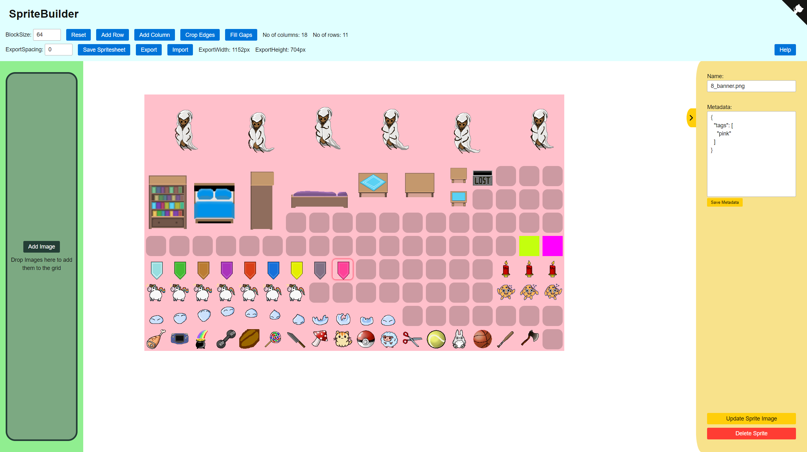

# SpriteBuilder

[SpriteBuilder](https://h0rn0chse.github.io/SpriteBuilder/) is a tool to combine single sprites into spritesheets. The images are only saved within the browser cache. This tool optimzed for the godot plugin [Godot Atlasica](https://github.com/AnJ95/godot-atlasica). You can create and manage your spritesheets in SpriteBuilder and import the result into the plugin.

* [How To Basics](#how-to-basics)
* [Libraries](#libraries)
* [Controls](#controls)
* [Limitations](#limitations)
* [FAQ](#faq)

 

## How To Basics

 * Adjust your block size
 * Reset the grid
 * Ensure the grid is big enough
 * Drop your images into the area
 * Save as spritesheet

## Libraries

 * Grid: https://github.com/haltu/muuri
 * Drag: https://github.com/anvaka/panzoom
 * CSS: https://github.com/franciscop/picnic
 * Icons: https://github.com/feathericons/feather
 * Zip: https://github.com/Stuk/jszip
 * Github-Corner: https://github.com/remarkablemark/github-corners

## Controls
 * Move Grid: Ctrl + Drag / Shift + Drag
 * Open Inspector: Double Click on Sprite
 * Close Inspector: Esc

## Limitations
You might experience some performance issues with extra large grids (>3000 items).

## FAQ
**How do I change the blocksize?** 
Press the reset button. But keep in mind that the grid will be rebuilt and all your progress will be lost!

**Where is the sprite aligned in case is is smaller than the blocksize** 
Top left corner.

**What is the best workflow for arranging sprites of different sizes** 
Add all sprites to the grid. Start with the biggest sprites on the top and arrange the line by line from top to bottom.